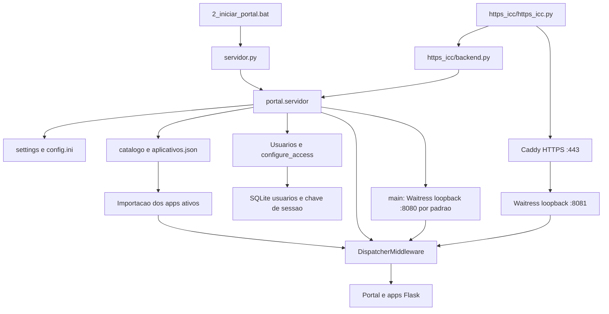

# Arquitetura atual do Portal de Aplicações

Levantamento de 16/09/2026, baseado no código de `C:\C\Projetos_Phyton\Portal_Apps`. Estado observado; as propostas de mudança estão no documento PLANO_PORTAL_BASE.

## Inicialização e fluxo

`portal/__init__.py` é apenas o marcador do pacote. O bootstrap funcional está em `portal/servidor.py`, não em uma factory central. Na importação, o módulo lê o catálogo, instancia Flask e `Usuarios`, instala os controles e monta `application`. `main()` prepara o primeiro administrador, inicia Waitress e abre o navegador após consultar `/saude`.

O caminho direto usa seis threads, limite WSGI de 33 MiB e porta de `config.ini`, com fallback 8080 (`portal/servidor.py:51`, `portal/settings.py:12`). O complemento HTTPS usa oito threads e porta fixa 8081 (`https_icc/backend.py:9`). Limites menores definidos por cada Flask continuam aplicáveis.

## Módulos do núcleo

| Arquivo | Responsabilidade e dependências |
|---|---|
| `servidor.py` | Entrada pequena que chama `portal.servidor.main` |
| `portal/settings.py` | Calcula `BASE_DIR`; exige `config.ini` e `[documentos].pasta_clientes`; lê porta |
| `portal/integracao.py` | Lê `config_apps.ini` separadamente e resolve caminhos relativos contra `BASE_DIR` |
| `portal/catalogo.py` | Valida entradas, importa módulos explicitamente permitidos pelo padrão e monta dicionário rota → app |
| `portal/servidor.py` | Portal, menu, saúde, acesso central, composição WSGI e Waitress |
| `portal/usuarios.py` | Persistência de usuários, permissões, sessões, tentativas e chave de sessão |
| `portal/acesso.py` | Hooks de autenticação, autorização, CSRF e cabeçalhos; telas de login/administração/senha |
| `portal/primeiro_admin.py` | Cadastro pelo console, sem senha padrão; recusa bootstrap quando há usuários sem administrador ativo |
| `portal/tarefas.py` | Uploads, execução de worker, acompanhamento, posse dos resultados e downloads |
| `portal/verificar.py` | Verificação de versões, arquivos do catálogo e caminhos; ainda contém lista fixa de integrações |
| `portal/atualizar_pacote.py` | Mescla novos cadastros/configurações/dependências e faz backup dos arquivos alterados; não é um instalador genérico de clientes |

## Catálogo e integração

`aplicativos.json` contém `nome`, `descricao`, `rota`, `modulo` e `ativo`. As entradas inativas são puladas antes da importação. Os módulos ativos precisam seguir `apps.<slug>.app`, exportando `app` chamável. As rotas seguem `/[a-z][a-z0-9-]*`, são únicas e não podem usar os prefixos reservados de autenticação, administração, saúde e estáticos.

O carregador rejeita uma lista sem apps ativos (`portal/catalogo.py:30`). Depois da validação WSGI, `configure_access` exige instâncias Flask (`portal/acesso.py:21`). Portanto, cumprir somente a interface WSGI não basta na arquitetura atual. O catálogo é carregado uma vez na importação; sua edição exige reinício. Não há instalação dinâmica de código por usuários.

| App / módulo em `apps/` | Rota | Estado | Integração e estado persistente |
|---|---|---|---|
| `aberturas` | `/aberturas` | Ativo | Flask próprio; planilha configurada, relatórios e metadados em `dados/apps/aberturas/relatorios`; SMTP; pode modificar planilha de origem |
| `analise_emails` | `/analise-emails` | Ativo | `portal.tarefas`; uploads, worker, configuração de pasta e resultados por execução |
| `buscar_nfe` | `/buscar-nfe` | Ativo | `portal.tarefas`; busca em repositório XML/PDF do HUB SIEG, ano configurável |
| `buscar_pdf` | `/buscar-pdf` | Ativo | `CLIENTS_ROOT`; PDFs por pasta de cliente, ZIP temporário e logs |
| `buscar_pdf_cnpj` | `/buscar-pdf-cnpj` | Ativo | Índice SQLite e resultados SQLite, busca textual, JSON local e configuração do portal |
| `carta_frete` | `/carta-frete` | Ativo | Conversão PDF/Excel com pdfplumber/openpyxl; entrada enviada e processamento em memória |
| `emite_guia` | `/emitir-guias` | Ativo | `portal.tarefas`; planilha enviada, Playwright/Chromium e SEFAZ/MT; arquivos por execução |
| `monitora_sieg` | `/monitora-sieg` | Ativo | Relatórios XLSX de pasta SIEG e relatório ICC; configuração lida do INI e painel/cache local ao processo |
| `planilha_amanda` | `/planilha-amanda` | Ativo | pandas, arquivos RCF externos, conversão e log com rotação; caminho absoluto de fallback |
| `monitora_certificados` | `/validade-certificados` | Inativo | `portal.tarefas`; diretórios CPF/CNPJ, correções em XLSX e worker legado; não importado pelo catálogo atual |
| `certificados` | `/certificados` | Ativo | Inventário SQLite, chave Fernet, PFX externos, auditoria, tickets e auxiliar Windows |
| `lembretes_tarefas` | `/lembretes` | Ativo | SQLite v3; templates próprios; fila e worker SMTP separado; consulta opcional ao inventário |

As fontes principais são os respectivos `app.py`, workers e `aplicativos.json`. A lista identifica integrações por código; não atesta que os caminhos externos estejam disponíveis.

## Autenticação, usuários e autorização

O portal usa contas locais em SQLite. Não foi encontrada integração de login com AD/LDAP/OAuth no núcleo. A senha é transformada por `werkzeug.security.generate_password_hash`, validada com `check_password_hash`; o valor e os hashes não foram lidos. A regra atual aceita 4 a 128 caracteres (`portal/usuarios.py`, `validate`).

Após login, um token aleatório é colocado na sessão Flask e seu SHA-256 é persistido em `sessions`, com duração de oito horas. A chave de assinatura vem de `dados/chave_sessao.txt`. O cookie é `icc_portal_session`, caminho `/`, HttpOnly, SameSite Lax e Secure conforme `[seguranca].cookie_https`, atualmente verdadeiro. Todos os apps recebem a mesma configuração de sessão da instalação.

Cada requisição resolve o usuário ativo e suas permissões no banco. Administradores acessam todos os apps ativos; outros usuários precisam da rota em `permissions`. O menu é apenas uma apresentação dessas permissões. A verificação também cobre URLs diretas, APIs e downloads que passam pelos hooks dos apps montados.

Login e saúde são endpoints públicos do portal. Métodos diferentes de GET/HEAD/OPTIONS exigem token CSRF, inclusive o POST de login. Os templates recebem `csrf_token()` e `usuario`; os apps usam `g.usuario`. O logout é POST. A troca de senha e a desativação revogam sessões. Há bloqueio após cinco falhas por conta ou trinta por IP em quinze minutos.

A administração cria/edita contas, estado ativo, flag de administrador e rotas. O código protege o último administrador ativo e impede o administrador de retirar sua própria administração/desativar-se pela tela. Não há registro central dedicado de auditoria das alterações administrativas no esquema atual.

No app Certificados, há uma segunda aplicação Flask interna para o auxiliar, montada em `app.wsgi_app`, com validação própria de HTTPS/tickets. Ela não deve ser descrita como protegida exclusivamente pelo hook normal de sessão. `alive()` consulta diretamente `sessions`, `users` e `permissions` do banco central (`apps/certificados/app.py:67`). Essa dependência precisa continuar válida ao evoluir a base.

## Bancos e relacionamentos

Cinco bancos operacionais foram identificados e tiveram seus metadados consultados sem escrita. Não há banco relacional único contendo todos os apps. Não foi encontrado campo de tenant no esquema observado; o isolamento pretendido é por instalação.

| Banco | Tabelas e estrutura observada |
|---|---|
| `dados/usuarios.sqlite3` | `users(id, username, name, password, admin, active)`; `permissions(user_id, route)`; `sessions(token, user_id, expires)`; `failures(username, ip, occurred)` |
| `dados/apps/certificados/inventario.sqlite3` | `certs(id, path, signature, payload, password, manual, seen)`; `meta(key, value)`; `audit(id, at, uid, cert, event, machine)`; `tickets(hash, cert, uid, sid_hash, route, created, expires, state, callback, callback_expires, machine, sha256, thumbprint)` |
| `dados/apps/buscar_pdf_cnpj/indice_pdfs.sqlite3` | `pdfs(caminho, caminho_relativo, tamanho, mtime_ns, conteudo_numerico, status, erro, ultimo_scan, atualizado_em)`; `indice_meta(chave, valor)` |
| `dados/apps/buscar_pdf_cnpj/resultados_buscas.sqlite3` | `resultados(token, usuario, criado, dados)` |
| `dados/apps/lembretes_tarefas/lembretes.sqlite3` | `tasks`, `collaborators`, `deliveries`, `history`, `audit`, `worker_state`, `task_models`, `holidays`; versão do esquema 3 |

Detalhamento de Lembretes:

| Tabela | Colunas |
|---|---|
| `tasks` | `id, name, email, title, description, links, start_date, clock, timezone, rule, next_ts, next_index, last_sent, created_at, updated_at, created_by, created_by_name, status, send_count, scheduled_count, skipped_count, last_error, revision, business_day_policy, priority, department, client, deadline_ts, completed_at` |
| `collaborators` | `id, name, name_key, email, email_key, active, created_at, updated_at, created_by, updated_by, revision` |
| `deliveries` | `id, request_key, task_id, kind, generation, ordinal, scheduled_ts, payload, actor_id, actor_name, state, available_at, created_at, started_at, finished_at, attempts, error, message_id, purpose` |
| `history` | `id, delivery_id, at, result, detail` |
| `audit` | `id, task_id, at, actor_id, actor_name, action, detail` |
| `worker_state` | `id, heartbeat, pid, smtp_ready, last_error` |
| `task_models` | `id, name, title, description, links, rule, active, created_by, updated_by, created_at, updated_at, revision` |
| `holidays` | `day, name, created_by, created_at` |

No banco central, `users.id` é chave primária, `username` é único, e a chave de `permissions` é composta por usuário/rota; o código habilita foreign keys. As relações com bancos dos apps são lógicas: IDs de usuário aparecem em tarefas, auditorias, tickets e metadados sem uma foreign key entre arquivos SQLite. Em Lembretes, nomes e destinatários também são preservados em snapshots; editar um cadastro não deve reescrever histórico.

Certificados cifra senhas em BLOB usando uma chave local em `dados/apps/certificados/segredo.key`; banco e chave precisam de tratamento conjunto. O identificador do certificado depende de seu caminho (`core.py:199`). O índice PDF guarda caminhos e conteúdo numérico extraído, portanto também contém informação de cliente, mesmo sendo um cache.

`clients.py` de Lembretes consulta somente leitura o `payload` dos certificados ativos. Sem inventário, o usuário ainda pode informar o cliente manualmente. Não existe dependência de importação do app Certificados nem cadastro mestre compartilhado de empresas; `tasks.client` é texto.

Fontes de esquema: `portal/usuarios.py`, `apps/certificados/core.py`, `apps/buscar_pdf_cnpj/src/indice_pdf.py`, `apps/buscar_pdf_cnpj/app.py`, `apps/lembretes_tarefas/schema.sql`, `migrations.py` e metadados locais. O código de migração foi lido, não executado.

## Arquivos, tarefas e efeitos de inicialização

`portal/tarefas.py` grava em `dados/execucoes/<slug>/<token>/`: entradas, `parametros.json`, `execucao.json`, `resultado.json`, `processamento.log` e `saida/`. O token é UUID hexadecimal; downloads e histórico verificam o proprietário em `g.usuario['id']`.

Há um lock por app e semáforo global de três subprocessos, ambos em memória do processo. O worker roda com o mesmo Python, diretório e ambiente do portal, limite de duas horas e captura stdout/stderr. Essa separação de processos não muda a conta Windows nem as permissões de arquivos. Não constitui um serviço de filas distribuído. Após reinício, a tela identifica uma execução sem processo ativo como interrompida; não há retomada automática nesse mecanismo.

Efeitos que tornam inadequado importar tudo apenas para diagnóstico:

- `portal/usuarios.py:12`: cria diretório/chave e executa DDL na construção de `Usuarios`.
- `apps/certificados/app.py:262` e `core.py:65`: a instância global cria inventário, banco e chave quando necessário.
- `apps/buscar_pdf_cnpj/app.py:35-48`: cria logs e prepara índice na carga do módulo.
- `apps/aberturas/app.py:54-55` e apps de logs: criam diretórios/handlers.
- Lembretes adia Store até o uso, mas sua construção pode executar upgrade, backup e configurar WAL. Executar o worker para “verificar” também exige analisar esse caminho.

## Configuração e precedência real

| Consumidor | Fontes |
|---|---|
| Núcleo / Buscar PDFs / Amanda | `portal.settings.CONFIG`: somente `config.ini`; caminhos relativos ao portal |
| Integrações comuns | `portal.integracao.CONFIG_APPS`: somente `config_apps.ini`; `caminho()` resolve contra o portal |
| Certificados | `config.ini`, depois `config_apps.ini`; segunda leitura sobrescreve opções coincidentes; fallback para configurações legadas |
| Buscar PDFs por CNPJ | JSON do app para opções de busca/log; pasta pode ser substituída por `config_apps.ini`; bancos/logs são redirecionados para raiz do portal |
| Monitora SIEG | Lê `config_apps.ini` diretamente; valida `pasta_sieg` e `relatorio_icc` |
| Lembretes | `dados/apps/lembretes_tarefas/config.ini`, defaults do app e variáveis específicas de ambiente; senha obtida de `PORTAL_SMTP_SENHA` |

`config.old` é cópia histórica; não foi encontrada leitura dele nos loaders examinados. Seções repetidas nos dois INIs não significam precedência global. O arquivo a editar depende do consumidor. Em Aberturas, o código usa uma variável de senha específica da conta, enquanto mensagens de erro citam a variável genérica; isso deve ser reconciliado na adaptação.

## Templates, estáticos e logs

`portal/templates/` contém login, conta, senha, administração, negativa de acesso e menu. O CSS/JS do menu está no próprio HTML; não foi localizada pasta de estáticos do núcleo equivalente às pastas dos apps. O menu usa iframe e cabeçalhos SAMEORIGIN.

Apps com interfaces maiores têm `templates/` e `static/` próprios, como Certificados, Lembretes e Buscar PDFs por CNPJ. Aberturas e `portal.tarefas` também geram HTML por `render_template_string`; Monitora SIEG usa `index.html` na raiz do app. A aparência não é controlada por um tema único.

| Origem | Destino/mecanismo |
|---|---|
| Buscar PDFs | `logs/buscar_pdf/buscador_documentos_v2.log`; `logging.basicConfig` com arquivo e console |
| Buscar PDFs por CNPJ | `logs/buscar_pdf_cnpj`; logger próprio e retenção configurada no JSON |
| Planilha Amanda | `logs/planilha_amanda/planilha_amanda.log`; rotação de 5 MB e três backups |
| Worker Lembretes | `logs/lembretes_tarefas/agendador.log`; rotação de 2 MB e cinco backups |
| Tarefas com subprocessos | `processamento.log` dentro de cada execução |
| Complemento HTTPS | `https_icc/logs/python_<data>.log` e `caddy_<data>.log`, capturando subprocessos |
| Auditoria de negócio | Tabelas `audit` de Certificados e Lembretes |

O código mostra mecanismos diferentes de retenção; não se verificou retenção operacional. Não foi observado bloco dedicado de access log no Caddyfile atual. Logs/execuções podem conter caminhos, informações fiscais e parâmetros; não devem compor a base.

## Servidor, instalação e dependências

O Caddyfile usa `tls internal`, bind no IP ICC, armazenamento absoluto em `dados/caddy_https` e proxy local. O backend confia apenas no proxy `127.0.0.1` para proto/host/porta e limpa cabeçalhos não confiáveis. Scripts de exportação distribuem certificado público de confiança e auxiliar. As chaves privadas da CA pertencem à instalação.

`https_icc/https_icc.py` configura arquivos, faz backups e gerencia subprocessos Python/Caddy. `ensure_portal()` exige inclusive o app Certificados: é um complemento especializado, ainda não um servidor genérico da base. Nenhum serviço Windows em execução foi confirmado.

`1_instalar.bat` aceita Python >= 3.10, cria `.venv` e instala `requirements.txt`; a lista extra de Lembretes é tratada por seu ferramental. `5_instalar_navegador_guias.bat` instala Chromium para a conta Windows atual. O agendador é registrado por `ferramentas_lembretes/Instalar_Agendador.ps1`; credencial exportada em XML é vinculada à conta/máquina pelo mecanismo Windows, não portável como configuração comum.

O atualizador requer arquivos de entrada `novos_aplicativos.json`, `config_apps.novos.ini` e `requirements_novos.txt`, ausentes na raiz observada. Mescla metadados preservando existentes e faz backup; não fornece, sozinho, versionamento integral e rollback de código/dados.

Metadados locais: Python **3.14.7**, Flask **3.1.3**, Waitress **3.0.2**. As dependências diretas fixadas incluem pandas, openpyxl, xlrd, python-calamine, pdfplumber, pypdf, cryptography, playwright e defusedxml; Lembretes acrescenta tzdata **2026.4**. As versões diretas listadas foram encontradas no ambiente local. Isso não certifica compatibilidade em outras versões de Python, instalação nova ou ambiente de produção.

## Dependências entre módulos e cópias históricas

O núcleo conhece os apps pelo catálogo, mas os apps conhecem o núcleo via `portal.settings`, `integracao`, `tarefas`, `g.usuario`, sessão e helpers Jinja. Certificados conhece o esquema central; Lembretes conhece opcionalmente o esquema do inventário. Templates/URLs dependem do prefixo definido no catálogo.

Existem cópias de distribuição em `Releases/`, `apps/certificados/Release/` e `portal/Certificados_Portal_ICC/Certificados_Portal_ICC/`. A fonte do app ativo é a resolução do módulo presente no catálogo, não essas cópias. Elas aumentam o risco de selecionar código antigo ou incluir dados ao montar um pacote.

Foram localizados testes de Lembretes, do buscador CNPJ e testes de Certificados em pacotes históricos. Eles não foram executados nesta etapa. Sua presença não equivale a uma validação do estado atual; o escopo deste levantamento é leitura e documentação.
